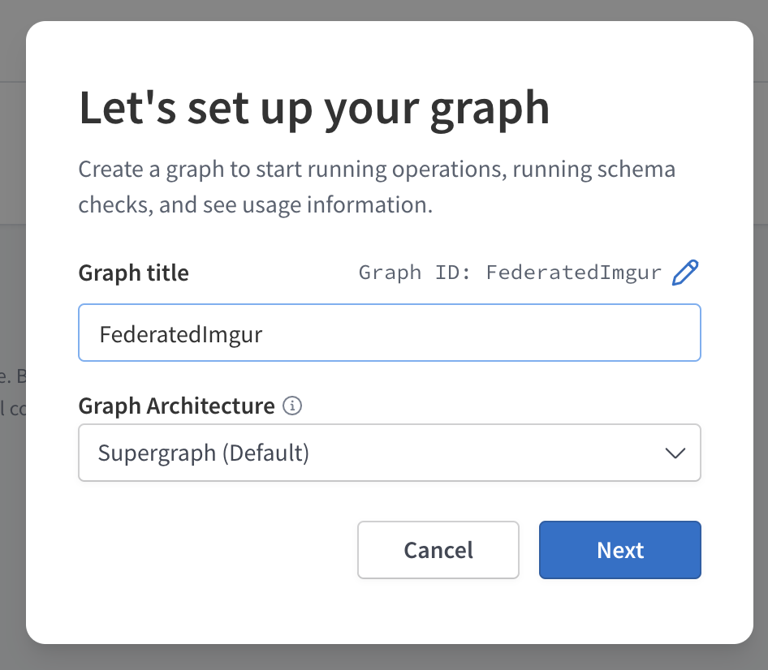
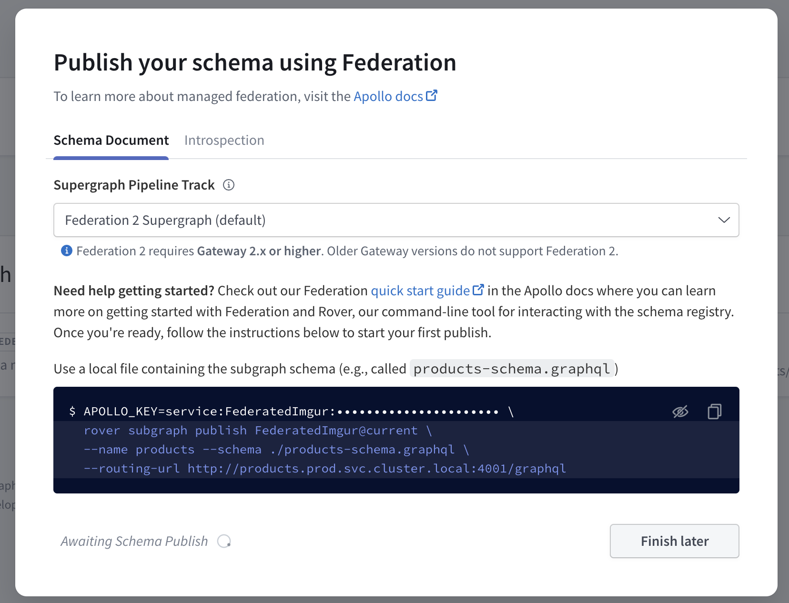

# Federation Training


## First Steps
* Go ahead and signup to Apollo Studio if you haven't already. [Link Here to Signup](http://studio.apollographql.com)
* Create a new [graph](https://www.apollographql.com/docs/studio/getting-started/#2-create-your-first-graph)
    * Enter your graph name, organization name (if your first graph) and specify Supergraph (default) for Graph Architecture

* Next, you'll be asked to publish your schema.  In this step, please select Federation 2 for your pipeline track.  Then go ahead and select "finish later".
    * Do copy the command provided to publish the schema as shown.  We won't use it, but we will want to save the APOLLO_KEY variable to your terminal profile properties laer.


From here, you will see we can publish our schemas to our registered subgraph in Apollo.  This will be done with the `rover subgraph publish` command, where we will publish each subgraph to the schema.  This will always need to be done atleast once for each new federated graph you do and can be automated with a configured automated pipeline.  For this project however, we will stick to using `rover subgraph publish` to make changes to our schemas.

## Setting up the Gateway
Next, go ahead and create a `gateway` subfolder.  Here we will place the code for our gateway.  The gateway acts as a router for all federated graphql requests, requests come in to this endpoint and it will then route each request to the proper subgraph(s).

* Run `npm init` in the `gateway` subfolder, and add the properties you would like (I would recommend specifying `gateway.ts` as your main entrance point, you can edit this later in the package.json if you would like)
* Run `npm install @apollo/gateway apollo-server graphql` to install the gateway, apollo-server, and graphql dependencies.
* Go ahead and import `import { ApolloGateway } from '@apollo/gateway';` and then initialize the gateway with an empty config object (we can add more config settings later).

## Auth
Add Bearer [access-token]

## Starting the Applications
Each service and your gateway will need to be ran at the same time.  Locally, this can be accomplished by manually running them all at the same time with your `yarn start` commmand, which will run the `start` script located in your `package.json` for each service.  You can also look into using docker and docker-compose to build containers of each of your services and the gateway, and then docker-compose will be used to spin up all the containers at once.  For this course however, we will use a script, `startfed` located in the root of the federation directory.

To use the script, run `chmod +x` on mac / linux machines to add the executable permission to the script.  Then you can type `./startfed` in the root of the federation folder to run the script


## Developing the Gateway
First we will create a config object.

Lets start building the subgraph services.  This seciton will create a introspection query - that will send a request to all the specified subgraphs and build the required information to the gateway.
Lets add this line to the config object:
```
buildService({ name, url }) {
    return new AuthenticatedDataSource({ url });
  },
```
This will build each service.  But first, we will need to also create a new class - AuthenticatedDAtaSource.  Lets create a new file - `authenticatedDataSource.ts` in the root of the `/gateway` folder.

Go ahead and paste the following in the `authenticatedDataSource.ts` file.
```
    import { RemoteGraphQLDataSource } from "@apollo/gateway";

    class AuthenticatedDataSource extends RemoteGraphQLDataSource {
        // @ts-ignore
        willSendRequest({ request, context }) {
        request.http.headers.set("x-user-id", context.userId);
    }
    }
```

As you can see, we are extending the RemoteGraphQLDataSource object, here we can add custom logic for our data sources.  Most commonly these classes edit the logic for `willSendRequest` and `didReceiveResponse`.

### willSendRequest
Override this method in a subclass to modify each outgoing fetch request before it's sent to the subgraph:
This method takes a requestContext object that contains both the original unmodified request and the current context.

### didReceiveReponse
Override this method in a subclass to customize the gateway's behavior after it completes a fetch to the subgraph, but before it sends a response to the requesting client
This method takes a requestContext object that contains:

* The subgraph's response
* The gateway's request to the subgraph
* The current operation's context
This enables you to modify any combination of the operation's context and the response of the fetch.

The http property of the request and response objects contains additional HTTP-specific properties, such as headers.

This method must return an object that matches the structure of a GraphQLResponse. If no modifications are necessary, return the original response.
Source: https://www.apollographql.com/docs/federation/api/apollo-gateway/#class-remotegraphqldatasource

### Service Library
As you'll notice we are copying the same files to each subgraph.  A best practice would be to seperate these repeated sections of code into a service-library.  When doing so in a professional environment, you'll want to ensure your package.json references the correct version numbers, and that the package-lock.json (or yarn.lock) all require the same graphql versions.  Howver, to reduce complexity for this project, we will simply copy the repeating files to each new subgrpah.


Helpful Documentation: [Apollo Studio - Getting Started](https://www.apollographql.com/docs/studio/getting-started/)